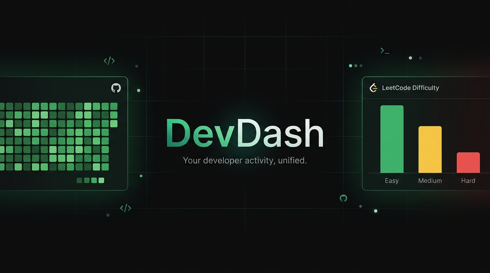

<p align="center">
  
</p>

<h1 align="center">DevDash</h1>

<p align="center">
  <strong>Your developer activity, unified.</strong><br/>
  A sleek, dark-mode dashboard that brings your GitHub contributions and LeetCode progress together in one place — with AI-powered insights powered by Gemini.
</p>

<p align="center">
  
  
  
  
  
  
  
</p>

---

## ✨ Features

| Feature | Description |
|---|---|
| 🔐 **Authentication** | JWT-based register, login, forgot/reset password |
| 🐙 **GitHub Dashboard** | Contribution heatmap, language breakdown, top repos, push cadence, activity feed |
| 💻 **LeetCode Dashboard** | Solve stats by difficulty, submission heatmap, acceptance rate, recent submissions |
| 📊 **Unified Overview** | Merged activity heatmap across both platforms, streak tracking, key stats at a glance |
| ✦ **AI Briefing** | Gemini-powered personalized insights — patterns, wins, and recommended next steps |
| 🔗 **Connections** | Link/unlink GitHub & LeetCode accounts from your profile at any time |
| 🌙 **Dark-first UI** | Minimal, premium dark interface with smooth micro-animations |

---

## 🏗️ Project Structure

```
devDash/
├── Frontend/                  # React + Vite app
│   ├── src/
│   │   ├── Components/
│   │   │   ├── Authentication/   # Login, Register, ForgotPassword
│   │   │   ├── Menu/             # Overview, GitHub, LeetCode, Connections
│   │   │   └── ui/               # Heatmap, Charts, Primitives
│   │   ├── hooks/                # useGitHubData, useLeetCodeData
│   │   ├── lib/                  # API helpers, AI client, connections
│   │   └── main.jsx              # Router + root render
│   └── vite.config.js
│
└── Backend/                   # Express 5 + MongoDB API
    ├── src/
    │   ├── controllers/          # user.controllers, ai.controllers
    │   ├── routes/               # user.routes, ai.routes
    │   ├── models/               # User, Platform, Tracking, PasswordResetToken
    │   ├── middleware/           # JWT auth middleware
    │   ├── services/             # ai.service (Gemini integration)
    │   └── utils/                # ApiError, constants
    └── index.js                  # App entry, CORS, error handler
```

---

## 🚀 Getting Started

### Prerequisites

- **Node.js** ≥ 18
- **MongoDB** instance (local or Atlas)
- **Gemini API key** ([Get one free](https://aistudio.google.com/app/apikey))

---

### 1. Clone the repository

```bash
git clone https://github.com/your-username/devDash.git
cd devDash
```

### 2. Backend setup

```bash
cd Backend
npm install
```

Create a `.env` file in `Backend/`:

```env
PORT=4000
MONGODB_URI=mongodb://localhost:27017/devdash
ACCESS_TOKEN_SECRET=your-super-secret-jwt-key
ACCESS_TOKEN_EXPIRY=5d
GEMINI_API_KEY=your-gemini-api-key
CORS_ORIGIN=http://localhost:5173
```

Start the dev server:

```bash
npm run dev
```

The API will be live at `http://localhost:4000`.

---

### 3. Frontend setup

```bash
cd ../Frontend
npm install
```

Create a `.env` file in `Frontend/`:

```env
VITE_API_BASE_URL=http://localhost:4000
```

Start the dev server:

```bash
npm run dev
```

Open `http://localhost:5173` in your browser.

---

## 🔌 API Reference

All endpoints are prefixed with `/api/v1`.

### User Routes — `/api/v1/users`

| Method | Endpoint | Auth | Description |
|--------|----------|------|-------------|
| `POST` | `/register` | ❌ | Create a new account |
| `POST` | `/login` | ❌ | Log in and receive a JWT |
| `POST` | `/forgotpassword` | ❌ | Request a password reset |
| `POST` | `/resetpassword` | ❌ | Reset password with token |
| `GET` | `/me` | ✅ | Get authenticated user profile |
| `PATCH` | `/connections` | ✅ | Update GitHub / LeetCode usernames |

### AI Routes — `/api/v1/ai`

| Method | Endpoint | Auth | Description |
|--------|----------|------|-------------|
| `POST` | `/insights` | ✅ | Generate personalized AI insights via Gemini |

> **Rate limiting**: Insights are cached for **24 hours** per user. A minimum 30-second cooldown applies between requests.

---

## 🧠 AI Insights

DevDash uses **Google Gemini** to analyze your developer stats and produce a personalized briefing:

- 📝 **Summary** — 2–3 encouraging and honest sentences about your activity
- 🏆 **Highlights** — 3–4 specific bullet points about your patterns and wins
- 🎯 **Recommendations** — 2–3 actionable next steps tailored to your data

Insights are **smart-cached**: generated once and served instantly for 24 hours, so repeated clicks are instant.

---

## 🛠️ Tech Stack

### Frontend
| Technology | Purpose |
|---|---|
| **React 19** | UI framework |
| **React Router 7** | Client-side routing & auth guards |
| **Tailwind CSS 4** | Utility-first styling |
| **Vite 8** | Lightning-fast dev server & bundler |
| **Lucide React** | Beautiful icon set |

### Backend
| Technology | Purpose |
|---|---|
| **Express 5** | REST API framework |
| **MongoDB + Mongoose 9** | Database & ODM |
| **JWT (jsonwebtoken)** | Stateless authentication |
| **bcrypt** | Secure password hashing |
| **dotenv** | Environment variable management |
| **nodemon** | Hot-reloading dev server |

### External APIs
| Service | Used for |
|---|---|
| **GitHub REST API** | Profile, repos, events, contribution data |
| **LeetCode GraphQL API** | Problem stats, submission history, rankings |
| **Google Gemini API** | AI-generated developer insights |

---

## 🌐 Deployment

### Frontend (Vercel)

The frontend includes a `vercel.json` for seamless deployment:

```bash
cd Frontend
npm run build
# Deploy via Vercel CLI or connect your GitHub repo to Vercel
```

### Backend

Deploy to any Node.js host (Railway, Render, Fly.io, etc.). Make sure to set all environment variables from your `.env` file in the host's dashboard.

---

## 🔒 Security

- Passwords are hashed with **bcrypt** before storage — never stored in plaintext.
- All authenticated routes require a valid **JWT Bearer token**.
- CORS is configured to only allow requests from trusted origins (defined via `CORS_ORIGIN` in `.env`, with automatic localhost allowance in development).
- Password reset tokens are stored hashed with a TTL expiry.

---

## 🤝 Contributing

Contributions are welcome! Here's how to get started:

1. **Fork** this repository
2. **Create** a feature branch: `git checkout -b feat/your-feature`
3. **Commit** your changes: `git commit -m "feat: add your feature"`
4. **Push** to your branch: `git push origin feat/your-feature`
5. **Open** a Pull Request

Please follow conventional commits and keep PRs focused on a single concern.

---

## 📄 License

This project is licensed under the **ISC License**. See the [LICENSE](./LICENSE) file for details.

---

<p align="center">
  Built with ❤️ and lots of ☕ &nbsp;|&nbsp; <strong>DevDash</strong>
</p>
